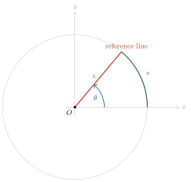
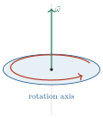
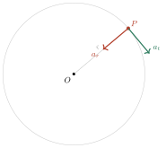
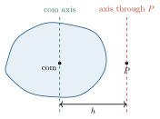
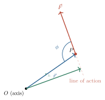

اب تک ہم نے زیادہ تر **انتقالی حرکت** (translation) کا مطالعہ کیا، جس میں کوئی جسم کسی سیدھی یا خمدار لکیر کے ساتھ آگے بڑھتا ہے۔ اِس باب میں ہم **گردشی حرکت** (rotation) کی طرف آتے ہیں، جس میں کوئی جسم کسی محور کے گرد گھومتا ہے۔ دلچسپ بات یہ ہے کہ گردش کے متغیرات یک بُعدی حرکت کے متغیرات سے بہت مشابہ ہیں — اگر کسی سوال میں ”زاویائی“ کا لفظ ہٹا دیا جائے تو اکثر وہ باب 2 کا عام حرکت کا سوال بن جاتا ہے۔

# گردشی متغیرات

## صلب جسم اور محورِ گردش

**صلب جسم** (rigid body) وہ جسم ہے جو اپنے تمام حصوں سمیت، اپنی شکل بدلے بغیر، یکجا ہو کر گھوم سکے۔ **مقررہ محور** (fixed axis) سے مراد ایسا محور ہے جو خود حرکت نہ کرے۔ خالص گردش میں جسم کا ہر نقطہ ایک دائرے میں گھومتا ہے جس کا مرکز محورِ گردش پر ہوتا ہے، اور ہر نقطہ کسی مقررہ وقفے میں یکساں زاویہ طے کرتا ہے۔

## زاویائی مقام

جسم میں جڑی ایک **خطِ حوالہ** (reference line) فرض کریں جو محور کے عمود پر ہو اور جسم کے ساتھ گھومے۔ اِس خط کا کسی مقررہ سمت (مثلاً مثبت $x$ محور) سے بننے والا زاویہ **زاویائی مقام** $\theta$ کہلاتا ہے۔ اگر دائرے کا نصف قطر $r$ اور قوس کی لمبائی $s$ ہو تو ریڈین میں:

$$\theta = \frac{s}{r} \qquad (\text{radian measure}).$$

ریڈین دو لمبائیوں کا تناسب ہونے کے سبب ایک خالص عدد ہے اور بے اِبعاد ہے۔ چونکہ $r$ نصف قطر والے دائرے کا محیط $2\pi r$ ہوتا ہے، اِس لیے پورے دائرے میں $2\pi$ ریڈین ہوتے ہیں:

$$1\ \text{rev} = 360^{\circ} = 2\pi\ \text{rad}, \qquad 1\ \text{rad} \approx 57.3^{\circ} \approx 0.159\ \text{rev}.$$

## زاویائی انتقال

اگر جسم اپنا زاویائی مقام $\theta_1$ سے $\theta_2$ تک بدلے تو **زاویائی انتقال** (angular displacement):

$$\Delta\theta = \theta_2 - \theta_1.$$

اصول: گھڑی کی مخالف سمت میں گردش **مثبت** اور گھڑی کی سمت میں **منفی** ہوتی ہے۔

## زاویائی رفتار

$\Delta t$ وقفے میں **اوسط زاویائی رفتار**:

$$\omega_{\text{avg}} = \frac{\theta_2-\theta_1}{t_2-t_1} = \frac{\Delta\theta}{\Delta t}.$$

**لمحاتی زاویائی رفتار** ($\omega$) اِسی تناسب کی وہ حد ہے جب $\Delta t \to 0$:

$$\omega = \frac{d\theta}{dt}.$$

اِس کی اکائی عموماً $\mathrm{rad/s}$ ہوتی ہے۔

## زاویائی اسراع

اگر زاویائی رفتار $\omega_1$ سے $\omega_2$ تک بدلے تو **اوسط زاویائی اسراع**:

$$\alpha_{\text{avg}} = \frac{\omega_2-\omega_1}{t_2-t_1} = \frac{\Delta\omega}{\Delta t}, \qquad \alpha = \frac{d\omega}{dt}.$$

اکائی عموماً $\mathrm{rad/s^2}$ ہوتی ہے۔

## کیا زاویائی مقداریں سمتیہ ہیں؟

زاویائی رفتار اور زاویائی اسراع کو **سمتیہ** (vectors) کے طور پر دکھایا جا سکتا ہے: اِن کا رخ محورِ گردش کے ساتھ ساتھ ہوتا ہے، جسے **دائیں ہاتھ کے اصول** سے طے کیا جاتا ہے۔

# مستقل زاویائی اسراع کے ساتھ گردش

جیسے انتقالی حرکت میں مستقل اسراع ایک اہم خاص صورت ہے، ویسے ہی گردش میں **مستقل زاویائی اسراع** اہم ہے۔ حرکیاتی مساوات انتقالی مساوات کے بالکل متوازی ہیں — صرف $x \to \theta$، $v \to \omega$، $a \to \alpha$ رکھ دیں:

$$\begin{aligned}
\omega &= \omega_0 + \alpha t,\\
\theta - \theta_0 &= \omega_0 t + \tfrac{1}{2}\alpha t^2,\\
\omega^2 &= \omega_0^2 + 2\alpha(\theta-\theta_0).
\end{aligned}$$

## مثال 1: مستقل زاویائی اسراع

**سوال:** ایک پہیہ سکون سے شروع ہوتا ہے اور $\alpha = 2.0\ \mathrm{rad/s^2}$ کے مستقل اسراع سے گھومتا ہے۔ $t = 5.0\ \mathrm{s}$ پر اِس کی زاویائی رفتار اور طے شدہ زاویہ کیا ہوں گے؟

**حل:** چونکہ $\omega_0 = 0$:

$$\omega = \omega_0 + \alpha t = (2.0)(5.0) = 10\ \mathrm{rad/s},$$

$$\theta - \theta_0 = \tfrac{1}{2}\alpha t^2 = \tfrac{1}{2}(2.0)(5.0)^2 = 25\ \mathrm{rad}.$$

# خطی اور زاویائی متغیرات کا تعلق

جب کوئی صلب جسم محور کے گرد گھومتا ہے تو اُس کا ہر نقطہ اپنے اپنے دائرے میں گھومتا ہے۔ سب کی زاویائی رفتار $\omega$ یکساں ہوتی ہے، مگر محور سے جتنا دور نقطہ ہو، اُس کی **خطی رفتار** اُتنی زیادہ ہوتی ہے۔

$$s = \theta r, \qquad v = \omega r, \qquad a_t = \alpha r, \qquad a_r = \frac{v^2}{r} = \omega^2 r.$$

# گردشی جمود اور متوازی محور کا مسئلہ

گھومتے جسم کی کل حرکی توانائی:

$$K = \tfrac{1}{2} I \omega^2, \qquad I = \sum m_i r_i^2 = \int r^2\, dm.$$

اگر مرکزِ کمیت سے گزرتے محور کے گرد جمود $I_{\text{com}}$ معلوم ہو، تو $h$ فاصلے پر متوازی محور کے گرد:

$$I = I_{\text{com}} + M h^2$$

(متوازی محور کا مسئلہ)

# مروڑ

**مروڑ** (torque) کسی جسم پر، کسی محور کے گرد، قوت کے ذریعے پیدا ہونے والا گھمانے کا عمل ہے۔ مروڑ کی مقدار:

$$\tau = r F \sin\phi = r_\perp F,$$

جہاں $r_\perp = r\sin\phi$ **بازوئے مروڑ** (moment arm) — محور سے قوت کے خطِ عمل تک عمودی فاصلہ — ہے۔

گردش کے لیے نیوٹن کا دوسرا قانون:

$$\tau_{\text{net}} = I\alpha$$

(ریڈین میں)

# خلاصہ {.unnumbered}

**گردشی متغیرات:** $\theta = s/r$؛ $\omega = d\theta/dt$؛ $\alpha = d\omega/dt$۔ گھڑی کی مخالف سمت مثبت۔

**خطی–زاویائی تعلق:** $s = \theta r$، $v = \omega r$، $a_t = \alpha r$، $a_r = \omega^2 r$۔

**گردشی جمود اور توانائی:** $K = \tfrac{1}{2}I\omega^2$؛ متوازی محور: $I = I_{\text{com}} + Mh^2$۔

**مروڑ:** $\tau = rF\sin\phi = r_\perp F$؛ گردش کا نیوٹن دوسرا قانون: $\tau_{\text{net}} = I\alpha$۔
